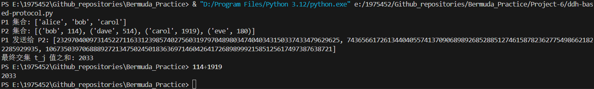

# Project 6

## 一、基于 DDH 假设的私有交集求和协议
DDH-based Private Intersection-Sum Protocol（基于 DDH 假设的私有交集求和协议）是一个两方安全计算协议，适用于隐私求和场景。算法的思想如下：

* 双方各自持有一个标识符集合：

  * P1：集合 $V = \{v_i\}$
  * P2：集合 $W = \{(w_j, t_j)\}$，每个标识符对应一个值 $t_j$
* 协议目标：

  * 计算交集标识符对应的值之和：

    $$
    S_J = \sum_{j \in J} t_j,\quad J = \{ j : w_j \in V \}
    $$
  * 不暴露非交集信息
  * P1 不获取 $t_j$，P2 不获取 $V$

协议安全性基于以下理论：

1. DDH 假设（Decisional Diffie–Hellman）
2. 加法同态加密（Paillier）
3. 哈希函数建模为随机预言机

---

## 二、算法流程概述

### 1. 算法的参数描述以及初始化
#### 1.1. 该算法包含如下公共的参数：
* 群 $G$（阶为大素数 $p$）
* 哈希函数 $H: U \rightarrow G$

#### 1.2. 算法初始化流程如下：
* P1 随机选择私钥 $k_1 \in \mathbb{Z}_p^*$
* P2 随机选择私钥 $k_2 \in \mathbb{Z}_p^*$
* P2 生成 Paillier 密钥对：  $$  (pk, sk)  $$

### 2. 算法的执行步骤
#### 2.1. 算法第一轮 Round 1（P1 → P2）

* P1 计算：
  $$
  \forall v_i \in V: H(v_i)^{k_1}
  $$
  得到集合 $\{H(v_i)^{k_1}\}$，乱序后发送给 P2。

#### 2.2. 算法第二轮 Round 2（P2）

* P2 对收到的每个元素再计算：
  $$
  (H(v_i)^{k_1})^{k_2} = H(v_i)^{k_1 k_2}
  $$
 得到 $Z = \{H(v_i)^{k_1 k_2}\}$，发送给 P1。

* 对自己的集合 $W$：

  * 计算 $H(w_j)^{k_2}$
  * 加密 $t_j$：$E(t_j) = pk.encrypt(t_j)$

  得到集合：
  $$
  \{(H(w_j)^{k_2}, E(t_j))\}
  $$
  P2 将上述集合发送给 P1。

#### 2.3. 算法第三轮 Round 3（P1）

* P1 对收到的 $H(w_j)^{k_2}$ 再计算：

  $$
  (H(w_j)^{k_2})^{k_1} = H(w_j)^{k_1 k_2}
  $$

  并将其与集合 $Z$ 比较，找出交集标识符对应的 $E(t_j)$。

* 与此同时，P1需要对交集密文进行同态求和：

  $$
  E(S_J) = E(t_{j_1}) + \cdots + E(t_{j_k})
  $$

  随机化密文（避免信息泄露）后发送给 P2。

#### 2.4. 输出（P2）

* P2 用私钥 $sk$ 解密：

  $$
  S_J = pk.decrypt(E(S_J))
  $$

---

## 三、Python 代码实现思路以及运行结果

### 1. 代码实现思路

#### 1.1️. 双方各生成 Diffie–Hellman 随机指数。

* P1 和 P2 分别生成随机私钥 $k_1, k_2$，用于对哈希后的标识符做模幂运算，实现**私有交集**。

#### 1.2️. P2 生成 Paillier 同态加密密钥对

* 用于对数值 $t_j$ 加密，并支持后续同态求和。

#### 1.3️. P1 对集合做哈希+加密后发送给 P2

* P1 将集合元素哈希后再以 $k_1$ 次幂，得到加密标识符。

#### 1.4. P2 再做一次加密+加密数值

* 对收到的元素再以 $k_2$ 次幂；同时对自己的 $t_j$ 用公钥加密。

#### 1.5. P1 找交集并同态求和

* 根据双重加密后的哈希值判断交集，只对交集里的密文 $t_j$ 做同态加法。

#### 1.6. P1 随机化密文

* 为避免泄露信息，P1 对最终密文重新随机化（重新加一个随机因子）。

#### 1.7. P2 解密得到交集和

* P2 用私钥解密密文，获得 $S_J = \sum_{j \in J} t_j$。

### 2. 代码实现结果：

给定一组输入，结果如下：

我们发现，该算法能够在输入中找到交集并正确处理（以进行加法运算为例），并且 P2 不会从 P1 发送的消息之中获取到有关这两个集合的任何信息。

* P1，P2集合此处进行展示是为了体现算法是否取得了交集，在实际之中不应该被揭示。
---

